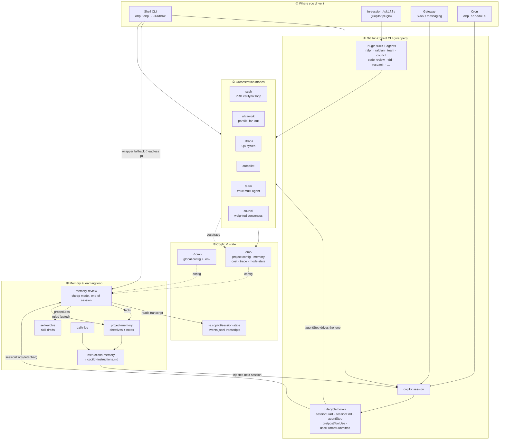

# oh-my-copilot

[](https://www.npmjs.com/package/@damian87/omp)
[](https://www.npmjs.com/package/@damian87/omp)
[](https://opensource.org/licenses/MIT)

**Multi-agent orchestration for GitHub Copilot CLI. Zero learning curve.**

_Don't relearn Copilot. Just use omp._

[Quick Start](#quick-start) • [Features](#features) • [In-session shortcuts](#in-session-shortcuts) • [Roadmap](#roadmap) • [Documentation](#documentation)

---

> Now on npm as [`@damian87/omp`](https://www.npmjs.com/package/@damian87/omp). One command and you're running.

## Quick Start

**Step 1: Install**

The shell CLI (`omp`):

```bash
npm i -g @damian87/omp
```

And the in-session skills, as a Copilot CLI plugin:

```bash
copilot plugin marketplace add damian87x/oh-my-copilot
copilot plugin install oh-my-copilot@oh-my-copilot
```

Requires Copilot CLI v1.0.48+. After install, `omp --madmax` works from any shell, and `/omp-autopilot`, `/ralplan`, `/code-review`, `/create-skill`, `/self-evolve`, and the rest are available inside any Copilot session.

**Step 2: Build something**

```bash
# Bare-flag launch with permissions bypass (alias of copilot --yolo)
omp --madmax -p "build a REST API for managing tasks"

# Or via in-session skill
/omp-autopilot "build a REST API for managing tasks"
```

That's it.

---

## Why oh-my-copilot?

- **Zero configuration** — works out of the box with sane defaults
- **Team-first orchestration** — parallel tmux panes, each running an independent agent session
- **Bare-flag bypass** — `omp --madmax` injects `--yolo` so non-interactive runs never block on a permission prompt
- **Persistent execution** — Ralph, UltraQA, and Ultrawork keep going until the goal is verified
- **File-state coordination** — workers swap typed messages over an outbox/inbox cursor with atomic `O_EXCL` task locks; no broker or daemon to babysit
- **Chat bridge** — `omp gateway` runs long-lived chat connectors (Slack today, more next) so you can DM Copilot from anywhere
- **Lifecycle hooks** — `sessionStart`, `userPromptSubmitted`, `preToolUse`, `postToolUse`, `postToolUseFailure`, `sessionEnd`, `errorOccurred`
- **Doctor included** — `omp doctor` verifies plugin manifest, skills discovery, hooks, and the underlying `copilot` CLI in one shot

---

## Architecture

oh-my-copilot is two things working together: a **shell CLI** (`omp`) that wraps and scripts the GitHub Copilot CLI, and a **Copilot plugin** that ships in-session slash skills, custom agents, and native lifecycle hooks. Both feed the same orchestration modes, the same file-based memory, and the same `.omp` state — so whether you drive from the shell, an in-session `/skill`, Slack, or cron, you hit one coherent system.



**The flow:** you launch a Copilot session from any surface ①. It runs through the wrapped Copilot CLI ②, where plugin hooks and skills can spin up orchestration modes ③ (ralph/ultrawork/ultraqa/team/council). When the session ends, the **learning loop** ④ fires — a cheap model reviews the transcript and writes durable **notes**, gated **directives**, and **skill drafts**, which `instructions-memory` injects into the *next* session so it starts smarter. Everything persists in layered config/state ⑤: global `~/.omp`, per-project `.omp/`, and Copilot's own session transcripts.

> The learning loop is **opt-in** (`omp config set memory-mode on`) and runs on a cheap model (`gpt-5-mini` by default) — the expensive reasoning already happened in your main session. See [docs/memory-mode.md](docs/memory-mode.md).

---

## Features

### Orchestration Modes

| Mode                 | What it is                                                       | Best for                                       |
| -------------------- | ---------------------------------------------------------------- | ---------------------------------------------- |
| **Team**             | tmux CLI workers on a shared task list with file-state outbox    | Coordinated parallel work on one objective     |
| **Autopilot**        | Single-lead autonomous loop (`/omp-autopilot`)                   | End-to-end feature work with minimal ceremony  |
| **Ralph**            | Persistent verify/fix loop with explicit reviewer                | Tasks that must complete fully (no partials)   |
| **Ultrawork**        | Maximum parallelism for fan-out tasks                            | Burst parallel fixes / refactors               |
| **UltraQA**          | QA cycling until tests/build/lint/typecheck all pass             | Quality gates needing repeat diagnose/fix      |
| **Ralplan**          | Consensus planning step before any loop                          | Vague requests that need decomposition first   |
| **Madmax (CLI)**     | `omp --madmax …` — bypass permissions for non-interactive runs   | Scripted / automated copilot invocations       |

### Intelligent Orchestration

- **7 specialized agents** — planner, architect, executor, verifier, code-reviewer, designer, researcher (all `--agent <name>` compatible with Copilot CLI)
- **22 in-session skills** auto-discovered from `.github/skills/`
- **Smart pipeline routing** — `/research-codebase` → `/ralplan` → `/team` / `/ralph` / `/ultrawork` → `/code-review` → `/ultraqa`

### Developer Experience

- **Context & history as CLI subcommands** — `omp state` (key-value with TTL), `omp project-memory` (notes + directives), `omp trace` (per-session timeline + summary), `omp goal` / `omp memory sync` (managed repo context), `omp daily-log`
- **Lightweight Copilot context** — managed instructions keep only the repo goal plus on-demand memory commands; set `OMP_DISABLE_INSTRUCTIONS_MEMORY=1` to skip writing the managed block entirely
- **Estimated cost ledger** — `omp cost [--today] [--session <id>]` summarizes local prompt/tool token estimates recorded by hooks. These are best-effort estimates, not provider billing.
- **File-state worker coordination** — outbox JSONL + byte cursor, atomic `O_EXCL` task locks, optimistic CAS on claim
- **Idle nudge** — content-based pane idle detection that pokes stuck workers
- **Mode-state loops** — single source of truth per loop (Ralph/Ultrawork/UltraQA state files)

---

## In-session shortcuts

These run **inside a Copilot CLI session** after the plugin is installed.

| In-session form         | Effect                                                    | Example                                              |
| ----------------------- | --------------------------------------------------------- | ---------------------------------------------------- |
| `/omp-autopilot`        | Full autonomous execution                                 | `/omp-autopilot "build a todo app"`                  |
| `/ralph`                | Persistence mode                                          | `/ralph "refactor auth"`                             |
| `/ultrawork`            | Maximum parallelism                                       | `/ultrawork "fix all type errors"`                   |
| `/ultraqa`              | QA cycling until goal met                                 | `/ultraqa "build green, tests pass"`                 |
| `/ralplan`              | Consensus planning                                        | `/ralplan "plan this feature"`                       |
| `/team`                 | Parallel tmux agent panes                                 | `/team`                                              |
| `/code-review`          | Diff-focused reviewer                                     | `/code-review`                                       |
| `/weighted-consensus`   | Multi-model council → one weighted verdict + minority report | `/weighted-consensus "JSON or YAML for config?"`  |
| `/research-codebase`    | Map an area of the codebase                               | `/research-codebase "auth middleware"`               |
| `/debug`                | Disciplined diagnose-reproduce-fix loop                   | `/debug "flaky integration test"`                    |
| `/tdd`                  | Red-green-refactor cycle                                  | `/tdd "add pagination to /users"`                    |
| `/verify`               | Exercise a change end-to-end                              | `/verify`                                            |
| `/create-skill`         | Author a new skill                                        | `/create-skill`                                      |
| `/self-evolve`          | Extract a learned skill from this session                 | `/self-evolve`                                       |
| `/jira-ticket`          | Render or apply a Jira ticket payload                     | `/jira-ticket`                                       |
| `/prototype`            | Throwaway prototype to flesh out a design                 | `/prototype "state shape"`                           |
| `/grill-me`             | Stress-test a plan with Socratic questions                | `/grill-me`                                          |
| `/caveman`              | Ultra-compressed communication mode                       | `/caveman`                                           |
| `/worktree`             | Git worktree-based parallel branch work                   | `/worktree`                                          |
| `/schedule`             | Durable local cron job — re-runs a prompt on a schedule, survives reboot | `/schedule "check the PR every 15 min"`   |
| `/goal`                 | Set/read the repo-level goal injected into the managed Copilot context | `/goal "ship v1.0 of the billing flow"` |
| `/daily-log`            | Per-day goal + work log surfaced at the start of new sessions | `/daily-log "ratelimit refactor landed"`        |

---

## Weighted consensus (model council)

`/weighted-consensus` fans a question out to several models **in parallel**, each
running independently with its own role, then a separate synthesizer model merges
their answers into one verdict — treating each member's weight as a **prior**, not
a vote tally — and surfaces a **minority report** instead of averaging dissent away.

It runs as `omp council` under the hood (engine in `src/council/`), so it works
both in-session via the skill and from the shell.

```bash
# Shell — default roster from .omp/config.json (or built-in default)
omp council "Should we adopt a monorepo? One paragraph."

# Pick the roster inline (model:role:weight, or bare models with default roles)
omp council "Is this migration safe?" \
  --models "gpt-5-mini:critic:1.5,gpt-4.1:architect:1" \
  --synth gpt-4.1 --json

# Feed a diff/file as shared context and an evaluation rubric
omp council "Review this change for blockers" --context @diff.txt --rubric @rubric.md
```

In-session, just ask:

```
/weighted-consensus "Should this service use gRPC or REST?"
/weighted-consensus "Compare these two caching strategies" --models gpt-5-mini,gpt-4.1
```

Configure the default roster in `.omp/config.json`:

```json
{
  "council": {
    "synthesizer": "gpt-4.1",
    "minSurvivors": 2,
    "maxConcurrency": 4,
    "members": [
      { "model": "gpt-5-mini", "role": "critic", "weight": 0.4 },
      { "model": "gpt-4.1", "role": "architect", "weight": 0.35 },
      { "model": "gpt-5-mini", "role": "pragmatist", "weight": 0.25 }
    ]
  }
}
```

Notes:
- Members run as independent `copilot --model <X>` processes — none sees the others' answers.
- Unavailable models (not on your Copilot plan) are detected and dropped; the
  council still synthesizes from survivors and fails only below `minSurvivors`.
- For real diversity prefer distinct models; on a free GPT-only plan, distinct **roles** still help (add a Claude/other-provider model if your plan includes one).
- Diversity comes from the model mix + per-role prompts; the Copilot CLI exposes no temperature knob.

---

## Terminal CLI

```bash
omp --help
omp version
omp doctor                                  # verify install + copilot binary
omp list                                    # show discovered skills and agents
omp setup [--dry-run] [--scope project|user]
omp launch -- [copilot flags…]              # forward arbitrary args to copilot
omp --madmax -p "edit src/foo.ts"           # bare-flag, maps to copilot --yolo
omp suggest "fix flaky tests"               # recommend a slash-skill workflow
omp team 3:executor "fix all type errors"   # spawn tmux workers
omp team status <name>
omp team shutdown <name>
omp ralph start "<task>" [--max-iterations N]
omp ultrawork start "<objective>" [--task-count N]
omp ultraqa start "<goal>" [--max-cycles N]
omp council "<question>" [--models a,b,c] [--context @file] [--json]   # multi-model council
omp cost [--today] [--session <id>]            # summarize estimated hook-ledger tokens
omp comms status | send | recv | ask        # drive a running copilot tmux session
omp gateway serve [--only slack]            # run chat connectors (today: slack)
omp gateway status [--json]                 # per-connector readiness (no sockets)
omp gateway notify --text "<msg>" [--target slack:C…|G…|D…|U… [:thread_ts]] [--thread-ts <ts>] [--json]
                                            # one-shot outbound Slack post; falls back to SLACK_HOME_CHANNEL
omp slack serve                             # deprecated alias of `gateway serve --only slack`
omp slack doctor [--json]                   # deprecated alias of `gateway status --only slack`
omp env init [--force]                      # write ~/.omp/.env (interactive Slack token setup)
omp schedule add --id <id> --cron "*/15 * * * *" --prompt "<text>" [--allow-all-tools] [--cwd <dir>] [--model <m>] [--timeout <ms>] [--max-runs N] [--ttl-hours H] [--notify-target slack:U0123ABCD] [--dry-run]
omp schedule list                           # registered jobs + OS-install status
omp schedule status <id>                    # last run + result summary
omp schedule run-now <id>                   # trigger one run immediately
omp schedule remove <id>                    # uninstall the OS entry + delete the job
omp goal set "<objective>" | read [--json]
omp memory sync [--json]                    # render goal + directives into copilot-instructions.md
omp daily-log set-goal "<text>" | add "<text>" | read [--days N] | prune [--keep-days N] [--json]
omp state write <key> <val> [--ttl <s>] | read | delete | status <key> | list | cleanup [--json]
omp project-memory read [<id>] | index | add-note "<title>" [--body "<text>"] | add-directive "<rule>" [--json]
omp trace timeline [<sessionId>] [--limit N] | summary [<sessionId>] | add <sessionId> <event> [<json>] [--json]
omp catalog list | validate | capability <id>
omp jira render <plan-file>
omp jira apply <key-or-plan> --comment|--update|--transition|--link
```

Environment overrides:

- `OMP_PLUGIN_ROOT` — path to the plugin checkout (with `OMC_PLUGIN_ROOT` accepted for back-compat)
- `OMP_COPILOT_BIN` — alternate `copilot` binary
- `OMP_BIN` — absolute path to the `omp` wrapper written into OS-scheduler entries (overrides `which omp`)
- `OMP_SKIP_USER_ENV` — when `1`, skip auto-loading `~/.omp/.env` (useful for hermetic CI runs)

**Scheduled jobs** register a durable per-job entry with the OS scheduler (macOS launchd,
Linux systemd-user timers, or a managed `crontab` block as a cross-platform fallback) that
invokes `omp schedule run --id <id>` on the cron schedule. Each tick spawns a fresh agent
session; overlapping runs are locked out and every run is killed at its `--timeout`
(default 5 min). Jobs default to **read-only** (`--allow-all-tools` is opt-in and prints a
warning) and auto-expire after 72h unless `--ttl-hours`/`--max-runs` say otherwise. Recent
run results are surfaced automatically at the start of new Copilot sessions. Always use
`omp schedule remove`, never delete `.omp/state/schedule/` by hand, so the OS entry is
uninstalled cleanly.

### Chat bridge: drive Copilot from Slack

`omp gateway` runs long-lived chat connectors that forward messages into a running
Copilot CLI session (via tmux) and post replies back. Today's connector is `slack`
(WebSocket Socket Mode — no public URL needed); the runtime is generic so future
connectors (Telegram, Discord, webhooks) drop in as one file each.

```bash
# 1. a Copilot tmux session is running (any `omp-<digits>` name)
tmux new-session -d -s omp-9999

# 2. interactive setup — explains where to grab each token and writes
#    ~/.omp/.env (chmod 600). Re-runnable; masks existing values.
#    `omp` auto-loads ~/.omp/.env every invocation; shell exports still win.
omp env init

# 3. preflight, then run
omp gateway status              # ready=true means tokens + session look good
omp gateway serve               # blocks; ^C stops cleanly
```

Full Slack-app setup (manifest + scopes) lives in [`docs/slack-setup.md`](docs/slack-setup.md).

---

## Roadmap

omp grows in vertical slices. Items aren't pinned to specific semver versions — they land when they're ready.

### Already shipped

- **Scheduled tasks** (v0.6.0) — durable local cron: `omp schedule add --id pr-watch --cron "*/15 * * * *" --prompt "…"` plus `/schedule` in-session. Each job registers an OS-scheduler entry (launchd / systemd-user / crontab fallback) that fires a fresh agent session, survives reboot, locks out overlap, and surfaces results at the next session start.
- **Chat bridge — Slack inbound** (v0.8.0) — `omp gateway` runs long-lived chat connectors that forward messages into a running Copilot tmux session and post replies back. Slack is the first connector (Socket Mode, no public URL). `omp env init` walks you through one-time token setup; tokens live in `~/.omp/.env` (auto-loaded on every invocation). See [`docs/slack-setup.md`](docs/slack-setup.md).
- **Slack outbound — `omp gateway notify`** — stateless REST `chat.postMessage` from any process (cron `--notify-target`, in-session `/slack <message>`, ad-hoc `omp gateway notify --text "..."`). Default destination from `SLACK_HOME_CHANNEL`; explicit `--target slack:C…/G…/D…/U…` overrides; `U…` auto-resolves to a DM via `conversations.open`.
- **Weighted-consensus council** — multi-model council with role weights + minority report. Via `omp council` or `/weighted-consensus`.
- **Suggest** — `omp suggest "<task>"` recommends a slash-skill workflow without launching one.
- **Estimated cost ledger** — hook-driven prompt/tool token estimates are visible through `omp cost`; oversized `postToolUse` output is minimized before it re-enters model context, with raw output preserved on disk (diagnostics kept inline; other trimmed detail is recoverable by re-reading the raw path the hook reports — an extra tool call, so best with capable models). Budget gates and retry-cost guidance remain next-step optimization work, not shipped behavior yet.

### Up next

- **More chat connectors** — Telegram, Discord, generic webhook on the same `omp gateway` runtime. One file per connector.
- **Outbound notifications** — long-running modes ping you when they finish, fail, or stall (`omp notify add` + per-invocation `--telegram`/`--discord`/`--slack` tags).
- **Checkpoints + rollback** — auto-snapshot the working tree before any tool-driven file edit; `omp rollback [id]` reverts a checkpoint. Safety net for autonomous loops.
- **Browser tool** — web search / page extraction / full automation (navigate, click, type, screenshot) for research skills that need fresh data instead of training-cutoff guesses.

### Later

- **HUD-lite statusline** — live orchestration metrics in the terminal: active mode, current task, worker count, tokens, cache hit rate, last error.
- **Provider routing** — fine-grained per-task provider selection: sorting, whitelists, priority ordering, cost-aware fallback. For mixed pipelines that want Opus for planning and Haiku for grunt work without manual model switching.
- **Skill learning** — extract repeating patterns from session transcripts into reusable skill files with strict quality gates. Auto-injects into context when relevant triggers fire.
- **Pre-built agent templates** — one-shot deployable templates for common workflows (research, security audit, design-system migration, content automation). `omp template add <name>` drops a curated skill + agent pair into your project.

---

## Documentation

- [General skills](docs/general-skills.md) — slash-skill layout, capability IDs, portability rules
- [Copilot distribution](docs/copilot-distribution.md) — project/user skill installs and the case against GitHub App Extensions
- [Jira adapter](docs/jira.md) — configuration discovery, safe operations, dry-runs, fallback payloads
- [Self-evolve](docs/self-evolve.md) — extracting reusable skills from session transcripts
- [Slack setup](docs/slack-setup.md) — Slack app manifest, scopes, Socket-Mode token, `omp gateway serve`

## Layout

```text
.github/agents/<name>.md          # custom agents discoverable via --agent
.github/skills/<name>/SKILL.md    # in-session slash skills
hooks/hooks.json                  # lifecycle hook manifest
scripts/*.mjs                     # hook implementations
src/                              # omp CLI, team runtime, gateway/comms, schedule, mode-state loops
```

Skills follow the [Copilot agent-skills docs](https://docs.github.com/en/copilot) — project skills live in `.github/skills/` and are invoked with `/skill-name`.

---

## Local development

```bash
npm install
npm run build
npm link                                       # makes `omp` point to your local checkout
npm test
npm run lint:skills
npm run sync:dry-run
```

After `npm link`, the global `omp` command runs your local build. Any changes you make are reflected after `npm run build`.

To unlink and revert to the published package:

```bash
npm unlink -g @damian87/omp
npm i -g @damian87/omp
```

## Releasing (maintainers)

One command runs the whole flow — quality gates → version bump → tag → push →
GitHub release → `npm publish`. It's a maintainer script (`tools/release.sh`),
**not** a published plugin skill, so it never ships in the package or appears in
the in-session skill catalog. npm 2FA is on, so pass an authenticator code via `--otp`.

```bash
npm run release -- minor --otp 123456     # bump 0.x.0, tag, push, GH release, publish
npm run release -- patch --dry-run        # validate everything, change nothing
npm run release:publish-only -- --otp 123456   # build + publish the CURRENT version (recover a half-done release)
```

The script refuses to run unless you're on a clean, up-to-date `main` and the
gates (`test`, `lint:skills`, `check:catalog`, `build`) pass.
